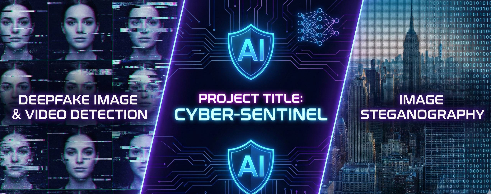

# CYBER-SENTINEL 🛡️



> **Advanced Deepfake Detection System** - Powered by ensemble deep learning models, featuring real-time analysis of images and videos through an intuitive web interface.

**DEEPFAKE DETECTION AND STEGNOGRAPHY**

[](https://www.python.org/downloads/)
[](https://pytorch.org/)
[](https://flask.palletsprojects.com/)
[](LICENSE)

 

---

## 🚀 Features

### 🎯 Core Capabilities
- **Real-time Image Detection** - Instant deepfake analysis with confidence scores
- **Video Frame Analysis** - Frame-by-frame detection with temporal consistency
- **Ensemble Model Architecture** - Combines CNN, ResNext, LSTM, and Vision Transformer
- **User Authentication** - Secure login/register system with session management
- **Detection History** - Track and review past analyses
- **API Access** - RESTful endpoints for programmatic integration
- **Feedback System** - Reinforcement learning from user corrections
- **Export Results** - Download detection reports as JSON

### 🧠 AI Models
| Model | Architecture | Accuracy |
|-------|-------------|----------|
| **Ensemble** | Combined CNN + ResNext + ViT + LSTM | ~92% |
| **Vision Transformer** | ViT-B/16 | ~90% |
| **ResNext** | ResNext-50 32x4d | ~88% |
| **LSTM** | Temporal Sequence Analysis | ~85% |
| **CNN** | Baseline Convolutional Network | ~82% |

---

## 🛠️ Installation

### Prerequisites
- Python 3.10 or higher
- pip package manager
- 8GB+ RAM
- CUDA 11.8+ (optional, for GPU acceleration)

### Quick Start

1. **Clone the Repository**
```bash
git clone https://github.com/Mohammed-razin-cr/cyber-sentinel.git
cd cyber-sentinel
```

2. **Create Virtual Environment**
```bash
python -m venv venv

# Windows
venv\Scripts\activate

# Linux/Mac
source venv/bin/activate
```

3. **Install Dependencies**
```bash
pip install -r requirements.txt
python setup.py
```

4. **Run the Application**
```bash
# Windows
run.bat

# Linux/Mac
./run.sh
```

5. **Access the Web Interface**
- Open browser: `http://localhost:5000`
- Login Page: `http://localhost:5000/login`

**Default Login Credentials:**
- Email: `admin@example.com`
- Password: `admin123`

---

## 🐳 Docker Deployment

### Using Docker Compose (Recommended)
```bash
docker-compose up -d
```

### Using Docker
```bash
# Build image
docker build -t cyber-sentinel .

# Run container
docker run -p 5000:5000 cyber-sentinel
```

---

## 📁 Project Structure

```
cyber-sentinel/
├── web_app/                      # Flask web application
│   ├── app.py                    # Main application entry
│   ├── auth.py                   # Authentication logic
│   ├── templates/
│   │   ├── index.html           # Main interface
│   │   └── login.html           # Login page (Red/Black gradient)
│   ├── static/
│   │   ├── style.css            # Global styles with animations
│   │   ├── script.js            # Frontend logic
│   │   └── auth.js              # Auth scripts
│   └── uploads/                  # User uploaded files
│
├── models/                       # Deep learning models
│   ├── cnn_model.py
│   ├── lstm_model.py
│   ├── resnext_model.py
│   ├── vision_transformer.py
│   └── ensemble_model.py
│
├── utils/                        # Utility functions
│   ├── preprocessing.py          # Image/video preprocessing
│   ├── inference.py              # Model inference pipeline
│   ├── metrics.py                # Performance metrics
│   └── rl_trainer.py            # Reinforcement learning
│
├── requirements.txt              # Python dependencies
├── setup.py                      # Setup script
├── train.py                      # Training script
└── README.md                     # This file
```

---

## 🔌 API Documentation

### Authentication Endpoints

#### Login
```bash
POST /api/auth/login
Content-Type: application/json

{
  "email": "admin@example.com",
  "password": "admin123"
}
```

#### Register
```bash
POST /api/auth/register
Content-Type: application/json

{
  "email": "newuser@example.com",
  "password": "secure_password"
}
```

### Detection Endpoints

#### Analyze Image
```bash
POST /api/detect/image
Content-Type: multipart/form-data

file: <image_file>
```

**Response:**
```json
{
  "success": true,
  "prediction": "real",
  "confidence": 0.87,
  "model_scores": {
    "cnn": 0.85,
    "resnext": 0.89,
    "vit": 0.88
  }
}
```

#### Analyze Video
```bash
POST /api/detect/video
Content-Type: multipart/form-data

file: <video_file>
```

#### Get Detection History
```bash
GET /api/history
Authorization: Bearer <token>
```

#### Submit Feedback (Reinforcement Learning)
```bash
POST /api/rl/feedback
Content-Type: application/json

{
  "result_id": "12345",
  "correct_label": "fake",
  "confidence": 0.95
}
```

---

## 🎨 UI Design

### Login Page
- **Background:** Red (#ef233c) to Black (#1a1a1a) gradient
- **Card:** White with shadow effects
- **Font:** Inter (clean, professional)
- **Animations:** slideInUp, slideInDown, scaleIn
- **Tab Navigation:** Login/Register with smooth transitions

### Main Interface
- **Theme:** Dark red and teal accent colors
- **Effects:** Glassmorphic cards with backdrop blur
- **Animations:** 8 custom keyframe animations
  - slideInUp/Down (0.6s)
  - scaleIn (0.5s)
  - pulse, glow, float
  - shimmer, bounce

---

## ⚙️ Configuration

### Environment Variables
Create a `.env` file:
```env
FLASK_ENV=production
SECRET_KEY=your-secure-random-key-here
MODEL_PATH=trained_models/ensemble_model.pth
DEVICE=cpu  # or 'cuda' for GPU
MAX_FILE_SIZE=524288000  # 500MB
DEBUG=False
```

### Model Configuration (`config.ini`)
```ini
[MODEL]
input_size = 224
frame_sampling = 10
batch_size = 32
confidence_threshold = 0.5

[SERVER]
host = 0.0.0.0
port = 5000
workers = 4
```

---

## 🚀 Performance

### Benchmarks
| Operation | CPU Time | GPU Time |
|-----------|----------|----------|
| Image Detection | 0.5-1.5s | 0.1-0.3s |
| Video (30s) | 15-30s | 3-5s |
| Batch (10 images) | 8-12s | 1-2s |

### System Requirements
**Minimum:**
- 4 CPU cores, 8GB RAM, 10GB disk

**Recommended:**
- 8+ CPU cores, 16GB+ RAM, NVIDIA GPU (8GB+ VRAM)

---

## 🔧 Training Custom Models

### Prepare Dataset
```bash
data/
├── train/
│   ├── real/
│   └── fake/
└── val/
    ├── real/
    └── fake/
```

### Train Model
```bash
python train.py \
  --model ensemble \
  --epochs 50 \
  --batch-size 32 \
  --lr 0.001 \
  --data-path ./data
```

---

## 🌐 Cloud Deployment

### AWS EC2
```bash
git clone <your-repo-url>
cd cyber-sentinel
docker-compose up -d
```

### Google Cloud Run
```bash
gcloud run deploy cyber-sentinel \
  --image gcr.io/PROJECT-ID/cyber-sentinel \
  --platform managed \
  --memory 2Gi
```

### Kubernetes
```bash
kubectl apply -f k8s/deployment.yaml
kubectl apply -f k8s/service.yaml
```

---

## 🐛 Troubleshooting

### Common Issues

**Port 5000 Already in Use**
```bash
# Windows PowerShell
Get-Process -Id (Get-NetTCPConnection -LocalPort 5000).OwningProcess | Stop-Process -Force

# Linux/Mac
lsof -ti:5000 | xargs kill -9
```

**CUDA Out of Memory**
```bash
# Use CPU instead
export DEVICE=cpu
```

**Missing Model Weights**
- Download pre-trained weights from releases
- Or train your own: `python train.py`
- System uses random weights for demonstration if unavailable

**Slow Detection**
- Enable GPU acceleration (if available)
- Reduce input image resolution
- Process smaller video clips

---

## 📊 Datasets Used

- **FaceForensics++** - Primary training dataset
- **Celeb-DF** - Celebrity deepfake videos
- **DFDC** - Deepfake Detection Challenge
- **Custom Dataset** - Proprietary augmented data

---

## 🤝 Contributing

Contributions welcome! Please:

1. Fork the repository
2. Create a feature branch (`git checkout -b feature/AmazingFeature`)
3. Commit your changes (`git commit -m 'Add AmazingFeature'`)
4. Push to the branch (`git push origin feature/AmazingFeature`)
5. Open a Pull Request

### Areas for Contribution
- 🎯 Additional model architectures
- 🎥 Real-time video streaming
- 📱 Mobile app development
- 🌍 Multi-language support
- 📈 Advanced analytics dashboard

---

## 📝 License

This project is licensed under the MIT License - see the [LICENSE](LICENSE) file for details.

---

## 🏆 Acknowledgments

- PyTorch team for the deep learning framework
- FaceForensics++ dataset creators
- OpenCV community
- Flask framework developers

---

## 📧 Contact

**Mohammed Razin CR**
- Portfolio: [mohammed-razin-cr.me](https://mohammed-razin-cr.me/)
- GitHub: [@Mohammed-razin-cr](https://github.com/Mohammed-razin-cr)
- Project: **CYBER-SENTINEL**

---

## 🗺️ Roadmap

- [x] Image detection system
- [x] Video analysis capability
- [x] Web interface with authentication
- [x] API endpoints
- [x] Reinforcement learning integration
- [x] Steganography detection
- [ ] Real-time webcam detection
- [ ] Mobile app (iOS/Android)
- [ ] Browser extension
- [ ] Attention map visualization
- [ ] Multi-language support

---

## ⚠️ Disclaimer

This tool is designed for educational and research purposes. It should not be used as the sole method for determining the authenticity of media content. Always verify important content through multiple sources.

---
<div align="center">
  
### ⭐ If you like this project, give it a star!

**CYBER-SENTINEL** | Made with ❤️ by Mohammed Razin CR

[Portfolio](https://mohammed-razin-cr.me/) · [Report Bug](https://github.com/Mohammed-razin-cr/cyber-sentinel/issues) · [Request Feature](https://github.com/Mohammed-razin-cr/cyber-sentinel/issues)

</div>

---

**Project:** CYBER-SENTINEL | **Last Updated:** December 5, 2025 | **Version:** 2.0.0 | **Status:** 🟢 Production Ready
